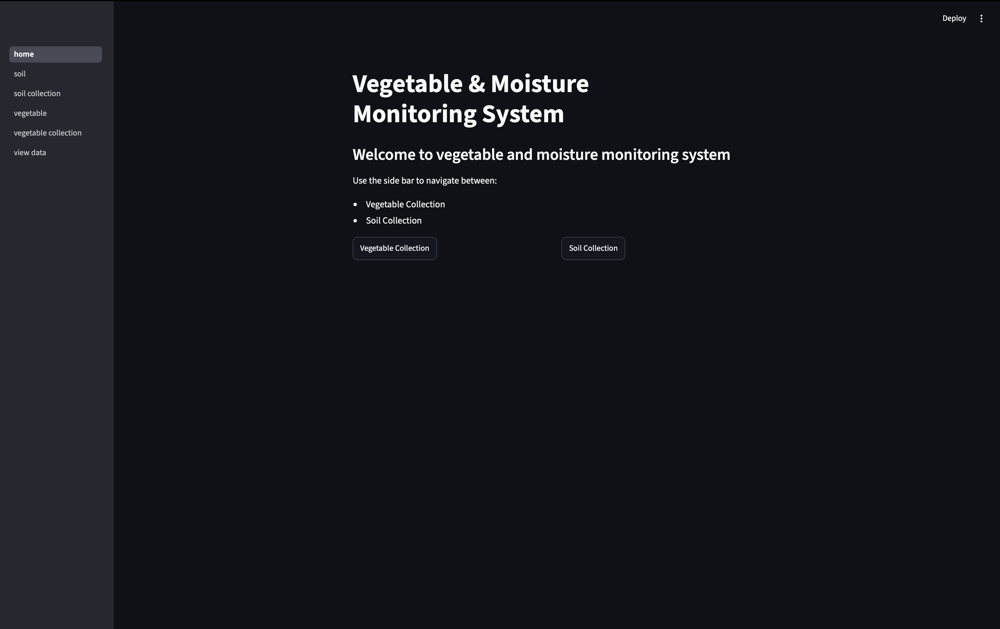
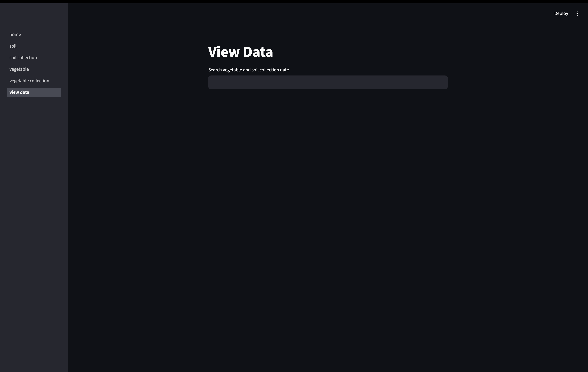
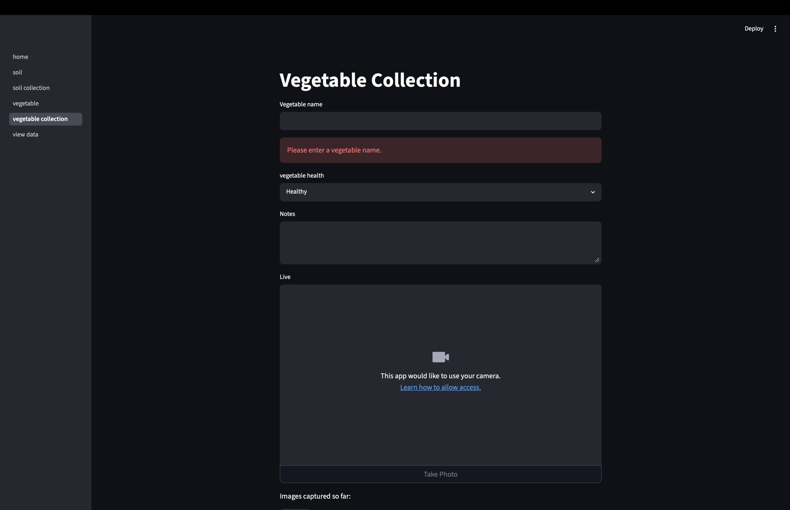
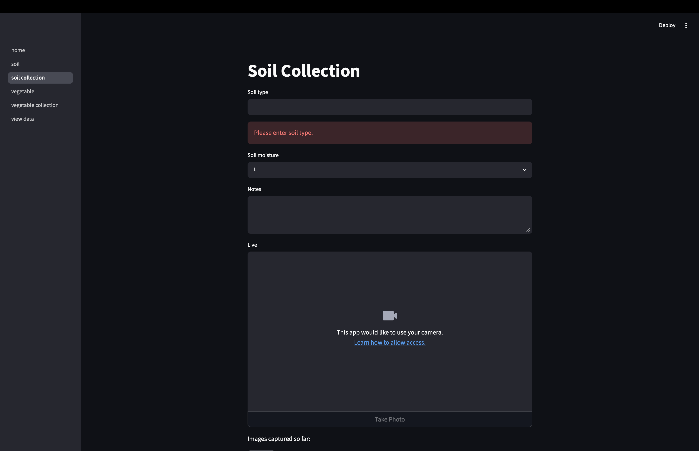

# Soil and Vegetable Monitoring System

## Overview

The Soil and Vegetable Monitoring System is a web-based application designed to collect, store, and manage vegetable and soil sample data. The system provides a Streamlit user interface for data collection and a FastAPI backend (Server) for data storage and retrieval.

The application supports:

* Vegetable data collection
* Soil data collection
* Image uploads for samples
* MongoDB data storage
* Querying and viewing collected data




---

## Technologies Used

### Frontend

* Streamlit

### Backend (Server)

* FastAPI
* Uvicorn

### Database

* MongoDB

### Networking / Deployment 
- ngrok (for remote access)

### Programming Language

* Python 3.10+

---
## Installation References
- MongoDB

Installed using the official MongoDB installation guide:
https://www.mongodb.com/docs/manual/installation/

- ngrok

Installed and configured using:
https://ngrok.com/docs/getting-started/

---

## Project Structure

```text
project/
│
├── Server/
│   ├── main.py
│   ├── db.py
│   └── images/
│       ├── vegetables/
│       └── soils/
│
├── UI/
│   ├── home.py
│   ├── key.py
│   └── pages/
│
├── requirements.txt
└── README.md
```

---

## Features

### Vegetable Collection

Users can:

* Enter vegetable name
* Enter vegetable health status
* Select collection date
* Add notes
* Upload images



### Soil Collection

Users can:

* Enter soil type
* Enter soil moisture information
* Select collection date
* Add notes
* Upload images


---

## Image Storage

Images are stored by sample and type:

```text
images/
├── vegetables/
│   └── sample_id/
│
└── soils/
    └── sample_id/
```

Each image is assigned a unique image ID and linked to a `sample_id`.

---

## Installation

### Clone Repository

```bash
git clone <repository-url>
cd project
```

### Create Virtual Environment

Mac/Linux:

```bash
python3 -m venv app
source app/bin/activate
```

Windows:

```bash
python -m venv app
app\Scripts\activate
```

### Install Dependencies

```bash
pip install -r requirements.txt
```

---

## MongoDB Setup

Install MongoDB and start the service.

Verify it is running:

```bash
mongosh
```

### Database Configuration

MongoDB is configured in:

```python
# Server/db.py

from pymongo import MongoClient

client = MongoClient("mongodb://localhost:27017")

db = client["Collections"]

vegetable_collections = db["vegetable"]
soil_collections = db["soil"]
image_collections = db["images"]
```

### Database Name

* Collections

### Collections

* vegetable
* soil
* images

---

## Running the Server (FastAPI)

Navigate to the Server directory:

```bash
cd Server
```

Start the server:

```bash
uvicorn main:app --host 0.0.0.0 --port 8000
```

Server runs at:

```
http://127.0.0.1:8000
```
---
## Exposing Backend (ngrok)
Because the frontend runs on a different machine, the backend is exposed using ngrok.

Start tunnel:
```bash
ngrok http 8000
```
Example output:
```
Forwarding https://xxxx.ngrok-free.app -> http://localhost:8000

```

Note: The ngrok URL changes whenever the tunnel is restarted. Update `UI/key.py` with the new URL before running the Streamlit application.

---

## UI Configuration
The Streamlit UI connects to the server using:

Update Streamlit configuration:
```python
# UI/key.py

URL = "https://xxxx.ngrok-free.app"
```

---

## Running the Streamlit UI

Navigate to UI directory:

```bash
cd UI
streamlit run home.py
```

UI runs at:

```
http://localhost:8501
```

---

## API Endpoints

### Create Vegetable Sample

```
POST /vegetables
```

### Create Soil Sample

```
POST /soils
```

### Upload Image

```
POST /images
```

Form Data:

* sample_id
* mode (vegetable | soil)
* file

---

### Get All Data

```
GET /data
```

---

## Future Improvements

* Remote camera integration
* Data analytics dashboard
* Automated plant health detection
* Machine learning image classification

---

## Author

Yarely Torres

